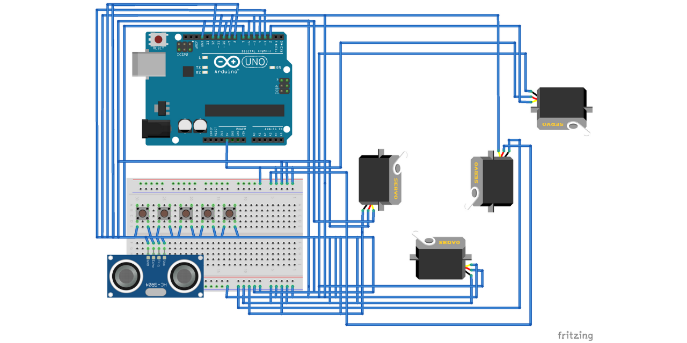

# Robotic Arm (IoT Project)
This is the mid-term project of the Robotics course and I worked it on with two of my friends. In this project, we created a Robotic Arm with the help of the Arduino Uno R3 board, motor servos, and the Arduino IDE using C++ programming language. 

The project that we are doing is about how to create a functional arm robot using Arduino and motor servos to control the arm's movement. There will be two functions existed on this arm robot. The first one is an automated function, where the robot itself with the help of an ultrasonic sensor will detect an object around its environment, and grab the object. Later, the robot will take the object to another place. While the second function is the manual function, where in order to take the object around its environment and place it in another type of place, the robot should be controlled by buttons that are existed.

For the detail on how we make it you may download and read our report that I have already attached within this repository.

